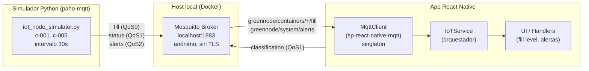
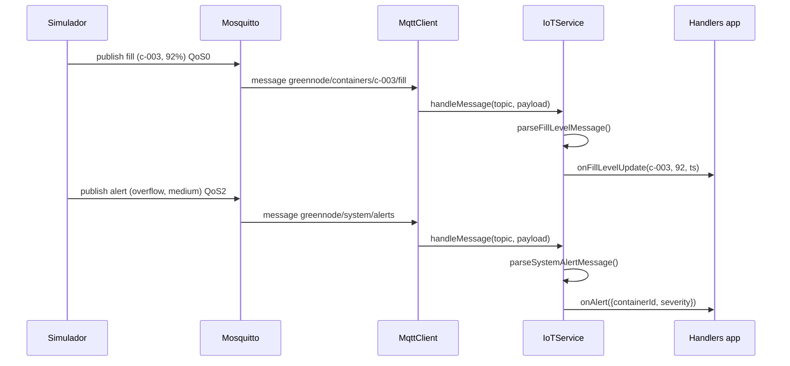
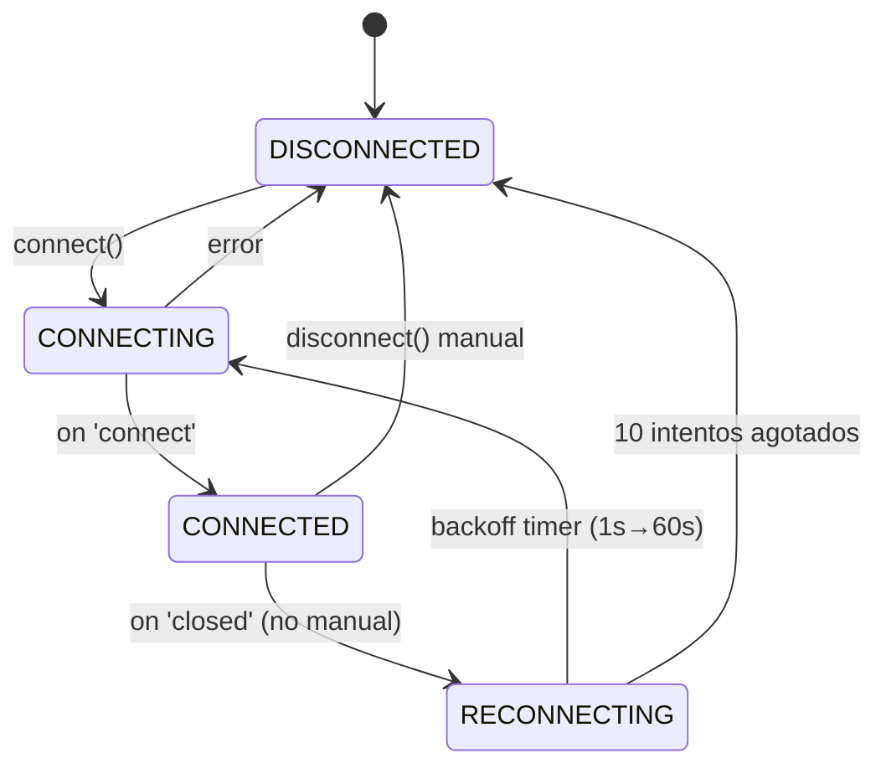

# Design Document

## Overview

Esta feature convierte la capa MQTT de GreenNode —hoy en modo simulado— en una
red IoT funcional para un entorno de demostración local (proyecto de grado, sin
TLS). Se apoya en la infraestructura ya existente en el repositorio y solo
introduce lo indispensable:

- **Broker real** (Eclipse Mosquitto) en Docker, puerto `1883`, listener
  anónimo, sin cifrado (Requirement 1).
- **Simulador Python** ya presente (`simulation/iot_node_simulator.py`), ajustado
  para modelar exactamente `c-001`..`c-005`, umbral de alerta 90 % y payloads con
  los campos que el parser de la app espera (Requirements 2 y 6).
- **Cliente MQTT real** activando `sp-react-native-mqtt` dentro del singleton
  `MqttClient.ts`, descomentando los bloques `TODO` ya escritos (Requirements 3,
  4, 5).
- **Verificación end-to-end** documentada con MQTT Explorer y logs (Requirement 7).

Principio rector: **no reescribir, activar**. La arquitectura de handlers
(Observer), el backoff exponencial, el rate limiting y el parser ya están
implementados. El trabajo consiste en sustituir las cuatro secciones marcadas con
`// TODO` y `// SIMULACIÓN` por llamadas a la librería real, levantar el broker y
alinear el simulador. Los formatos de mensaje se toman como fuente de verdad de
`MqttMessageParser.ts` para garantizar compatibilidad simulador ↔ app.

### Decisiones de diseño clave

| Decisión | Razón |
|----------|-------|
| Mosquitto en Docker en lugar de instalación nativa | El usuario ya tiene Docker; arranque reproducible y versionado (Req 1.3). |
| Listener anónimo sin TLS | Demo local; evita gestión de certificados y credenciales. `staging`/`production` conservan `mqtts://:8883` en `environment.ts`. |
| Reusar el simulador existente en vez de crear uno nuevo | Ya usa `paho-mqtt`, argparse (`--broker/--port/--interval`) y publica a los topics correctos; solo requiere ajustes de parámetros y severidad. |
| Mantener `mqtt://localhost` en `environment.ts` | Es la URI que `sp-react-native-mqtt` espera; no se cambia la configuración de desarrollo. |
| No cambiar las firmas públicas de `MqttClient`/`IoTService` | La app y los tests ya dependen de ellas; el cambio queda contenido en el cuerpo de los métodos. |

## Architecture

El sistema tiene cuatro piezas y un flujo unidireccional de telemetría
(simulador → broker → app) más un flujo de publicación de clasificaciones
(app → broker).



Secuencia de una actualización de llenado y una alerta:



Comportamiento de reconexión (Requirement 5):



## Components and Interfaces

### 1. Broker Mosquitto (Docker)

Dos archivos versionados en una carpeta nueva `mqtt/` en la raíz del repo. El
usuario ya tiene Docker, así que el arranque es `docker compose up -d` desde esa
carpeta. No expone interfaz de código; su contrato es el puerto `1883` con MQTT
v3.1.1 anónimo (Req 1.1, 1.2, 1.4).

`mqtt/docker-compose.yml`:

```yaml
services:
  mosquitto:
    image: eclipse-mosquitto:2
    container_name: greennode-mosquitto
    ports:
      - "1883:1883"        # MQTT sin TLS (Req 1.1)
    volumes:
      - ./mosquitto.conf:/mosquitto/config/mosquitto.conf:ro  # Req 1.4
    restart: unless-stopped
```

`mqtt/mosquitto.conf`:

```conf
# Demo local GreenNode — sin TLS, acceso anónimo (Req 1.1, 1.2)
listener 1883 0.0.0.0
allow_anonymous true

# Persistencia desactivada: la demo no necesita retener estado entre arranques
persistence false

# Logs a stdout para verlos con `docker compose logs -f`
log_dest stdout
log_type all
connection_messages true
```

Notas de diseño:

- La imagen `eclipse-mosquitto:2` **requiere** un `mosquitto.conf` explícito con un
  `listener` y `allow_anonymous true`; por defecto (v2) solo escucha en localhost
  del contenedor y rechaza conexiones remotas. Montar el archivo cubre Req 1.4.
- `0.0.0.0` en el listener permite que el emulador/dispositivo y el simulador del
  host alcancen el broker.
- El puerto ocupado (Req 1.5) se trata en la sección **Error Handling**.

### 2. Simulador (`simulation/iot_node_simulator.py`)

Componente Python ya existente que usa `paho-mqtt` y `argparse`. Se ajustan
valores por defecto y la lógica de umbral/severidad; no se reescribe.

**Ajustes de parámetros por defecto:**

| Argumento CLI | Defecto actual | Defecto nuevo | Requisito |
|---------------|----------------|---------------|-----------|
| `--broker`    | `localhost`    | `localhost` (sin cambio) | 2.1 |
| `--port`      | `1883`         | `1883` (sin cambio) | 2.1 |
| `--nodes`     | `50`           | `5` (produce `c-001`..`c-005`) | 2.2 |
| `--interval`  | `30`           | `30` (sin cambio, ya configurable) | 2.3 |

`generate_containers(n)` ya emite IDs `c-{i+1:03d}`, de modo que con `n=5` produce
exactamente `c-001`..`c-005` (Req 2.2). Solo cambia el defecto de `--nodes`.

**Cambios de lógica (dos gaps reales frente a los requisitos):**

1. **Umbral de alerta.** El código actual dispara la alerta en `fill_level >= 95`.
   Debe bajar a `>= 90` (`Umbral_Alerta`, Req 2.6, 6.1) y la severidad debe
   mapearse: `medium` si `90 <= fill <= 97`, `high` si `fill >= 98` (Req 6.2, 6.3).
   Se centraliza en una función pura `alert_severity(fill_level)` para poder
   testearla por propiedad:

   ```python
   ALERT_THRESHOLD = 90  # Umbral_Alerta (Req 6)

   def alert_severity(fill_level: float) -> str:
       """medium en [90,97], high en >=98 (Req 6.2, 6.3)."""
       return "high" if fill_level >= 98 else "medium"

   def build_alert(cycle: int, container) -> dict:
       return {
           "alertId": f"alert-{cycle}-{container.id}",
           "type": "overflow",                       # Req 6.1
           "containerId": container.id,
           "message": f"Contenedor {container.id} al {container.fill_level:.0f}% - requiere recolección",
           "severity": alert_severity(container.fill_level),
           "timestamp": datetime.now().isoformat(),
       }
   ```

   En el bucle principal, la condición pasa de `if container.fill_level >= 95:` a
   `if container.fill_level >= ALERT_THRESHOLD:`.

2. **Publicación del status.** Hoy `ContainerNode.update()` fija
   `self.status = "full"` al cruzar 90 pero **nunca publica** al `Topic_Status`.
   Req 2.5 exige publicar en `greennode/containers/{id}/status` con QoS 1 y
   `status: "full"`. Se añade la publicación en el bucle, junto a la alerta:

   ```python
   if container.fill_level >= ALERT_THRESHOLD:
       status_payload = {
           "containerId": container.id,
           "status": "full",                         # coincide con ContainerStatus.FULL
           "reason": f"fill_level >= {ALERT_THRESHOLD}",
           "timestamp": datetime.now().isoformat(),
       }
       client.publish(TOPICS["status"].format(container_id=container.id),
                      json.dumps(status_payload), qos=1)   # Req 2.5
       client.publish(TOPICS["alert"], json.dumps(build_alert(cycle, container)), qos=2)  # Req 2.6
   ```

Publica por ciclo: **fill** siempre (QoS 0, Req 2.4); **status** + **alert** al
cruzar el umbral (QoS 1 y QoS 2). Los campos extra `latitude`/`longitude` del
payload de fill son ignorados por el parser de la app y no rompen nada. La
desconexión ordenada ante `KeyboardInterrupt` (Req 2.8) y el log de error de
conexión con broker/puerto (Req 2.7) ya existen en el `finally`/`except` del
`main()`.

### 3. `MqttClient` (`src/data/datasources/remote/mqtt/MqttClient.ts`)

Singleton `mqttClient`. Interfaz pública **sin cambios**:

```typescript
connect(options?: MqttConnectOptions): Promise<void>
disconnect(): Promise<void>
publish(topic: string, payload: string, qos?: QoS): Promise<void>
publishClassification(topic: string, payload: string): Promise<boolean>
subscribe(topic: string, qos?: QoS): Promise<void>
unsubscribe(topic: string): Promise<void>
onMessage(handler: MessageHandler): Subscription
onConnectionChange(handler: ConnectionHandler): Subscription
getConnectionState(): MqttConnectionState
isConnected(): boolean
```

Los cambios son internos: reemplazar `simulateConnect()` y los bloques `TODO` por
llamadas a `sp-react-native-mqtt`, y conectar el evento `closed` del cliente real
con el `handleDisconnect()` que ya dispara el backoff.

**Bloques `TODO` a activar** (Req 3.1, 3.2, 4.1, 5.1):

1. En `connect()` — sustituir la llamada `await this.simulateConnect()` por la
   creación del cliente real y el registro de listeners. Se mantiene
   `reconnect: false` en la librería porque el backoff lo gestiona `MqttClient`
   (Req 5.1–5.3), no la librería:

   ```typescript
   const Mqtt = require('sp-react-native-mqtt').default;
   this.client = await new Promise((resolve, reject) => {
     const client = Mqtt.createClient({
       uri: `${ENV.mqttBrokerUrl}:${ENV.mqttPort}`, // mqtt://localhost:1883
       clientId,
       keepalive: options?.keepAlive ?? 30,
       reconnect: false,        // el backoff lo controla MqttClient
       clean: options?.cleanSession ?? true,
     });
     client.on('connect', () => resolve(client));
     client.on('error', (err: any) => reject(err));
     client.connect();
   });

   this.client.on('closed', () => this.handleDisconnect());   // dispara backoff (Req 5.1)
   this.client.on('error', (err: any) => logger.error('[MQTT] Error:', err));
   this.client.on('message', (msg: any) => this.handleMessage(msg)); // Req 3.3, 3.4
   ```

   `sp-react-native-mqtt` entrega los mensajes como `{ topic, data, qos, retain }`;
   el `handleMessage(msg)` existente ya lee `msg.topic` y `msg.data`, así que no
   requiere cambios.

2. En `publish()` — activar `this.client.publish(topic, payload, qos, false)`
   (Req 4.1). El guard de `CONNECTED` que lanza `MqttPublishError` (Req 4.4) ya
   está presente.

3. En `subscribe()` y `resubscribeAll()` — activar
   `this.client.subscribe(topic, qos)`. `resubscribeAll()` recorre
   `subscribedTopics`, cumpliendo la re-suscripción tras reconectar (Req 5.4).

4. En `disconnect()` — activar `this.client.disconnect()` antes de anular
   `this.client`. `isManualDisconnect = true` ya impide programar reintentos
   (Req 5.5).

El resto (state machine de conexión, `scheduleReconnect` con backoff, contador de
10 intentos, notificación de estado, rate limiting) **no cambia**: ya implementa
Req 5.2, 5.3, 5.6 y 4.2.

### 4. `IoTService` (`src/data/datasources/remote/mqtt/IoTService.ts`)

Orquestador. **Sin cambios de código** salvo (opcional) retirar los helpers de
simulación (`simulateFillLevelUpdate`, `startSimulation`) una vez validado el
flujo real. Su `initialize()` ya se suscribe a `allContainersFill()` (QoS 0) y
`systemAlerts()` (QoS 1). El único ajuste requerido por los requisitos: la
suscripción a alertas debe ser **QoS 2** para coherencia con el Topic_Alertas
(Req 3.2). Cambio de una línea:

```typescript
// antes:
await mqttClient.subscribe(MqttTopics.systemAlerts(), 1);
// después (Req 3.2):
await mqttClient.subscribe(MqttTopics.systemAlerts(), 2);
```

`handleIncomingMessage()` ya enruta correctamente: usa
`extractContainerIdFromTopic()` para fills (Req 3.3) y compara con
`systemAlerts()` para alertas (Req 3.4), descartando payloads inválidos vía el
parser que retorna `null` (Req 3.5). No requiere más cambios.

> **Nota de consistencia (fuente de verdad de topics).** `IoTService.ts` importa
> los topics de `MqttTopics.ts`, que es el módulo correcto. Existe un segundo
> módulo `src/shared/config/mqtt.ts` con un `MQTT_TOPICS` cuyo
> `userClassification` usa el patrón antiguo `greennode/{userId}/classification`
> (sin el segmento `users/`). Ese módulo **no** se usa en el flujo IoT y no debe
> mezclarse; los topics de esta feature se toman de `MqttTopics.ts`. Se documenta
> para evitar confusión, pero unificarlo queda fuera del alcance.

## Data Models

Los modelos son los tipos ya definidos en `MqttMessageParser.ts`. El simulador
debe emitir payloads que satisfagan estos parsers.

### Topics y QoS (de `MqttTopics.ts`)

| Constante | Topic | QoS | Dirección |
|-----------|-------|-----|-----------|
| `containerFillLevel(id)` | `greennode/containers/{id}/fill` | 0 | Sim → App |
| `containerStatus(id)` | `greennode/containers/{id}/status` | 1 | Sim → (Broker) |
| `systemAlerts()` | `greennode/system/alerts` | 2 | Sim → App |
| `allContainersFill()` | `greennode/containers/+/fill` | 0 | App suscribe |
| `userClassification(userId)` | `greennode/users/{userId}/classification` | 1 | App → Broker |

### Payload: Fill (`FillLevelMessage`, Topic_Fill, QoS 0)

Parser exige `containerId` y `fillLevel`. El simulador incluye además los campos
requeridos por Req 2.4:

```json
{
  "containerId": "c-001",
  "fillLevel": 73.4,
  "temperature": 15.2,
  "batteryLevel": 88.0,
  "timestamp": "2025-01-15T10:30:00.000Z"
}
```

> `latitude`/`longitude` extra son ignorados por el parser (no rompen nada).

### Payload: Status (`ContainerStatusMessage`, Topic_Status, QoS 1)

Emitido al cruzar el umbral (Req 2.5). `status` = `full` (coincide con
`ContainerStatus.FULL`):

```json
{
  "containerId": "c-001",
  "status": "full",
  "reason": "fill_level >= 90",
  "timestamp": "2025-01-15T10:30:00.000Z"
}
```

### Payload: Alert (`SystemAlertMessage`, Topic_Alertas, QoS 2)

Parser exige `alertId` y `type`. Campos requeridos por Req 2.6 y 6:

```json
{
  "alertId": "alert-12-c-001",
  "type": "overflow",
  "containerId": "c-001",
  "message": "Contenedor c-001 al 92% - requiere recolección",
  "severity": "medium",
  "timestamp": "2025-01-15T10:30:00.000Z"
}
```

`severity` = `medium` si `90 <= fillLevel <= 97`, `high` si `fillLevel >= 98`
(Req 6.2, 6.3).

### Payload: Classification (`ClassificationMessage`, Topic_Clasificacion, QoS 1)

Publicado por la app vía `serializeClassificationMessage`. Parser exige `userId` y
`wasteType`:

```json
{
  "userId": "u-42",
  "wasteType": "plastic",
  "confidence": 0.93,
  "timestamp": "2025-01-15T10:30:00.000Z",
  "location": { "latitude": 4.65, "longitude": -74.06 }
}
```
## Error Handling

| Escenario | Componente | Comportamiento | Requisito |
|-----------|------------|----------------|-----------|
| Puerto 1883 ocupado al arrancar el broker | Docker/Mosquitto | `docker compose up` falla con `bind: address already in use`. En el README de `mqtt/`: identificar el proceso (`netstat -ano | findstr 1883` en Windows) y detenerlo, o cambiar el mapeo de puerto. | 1.5 |
| Simulador no conecta al broker | Simulador Python | `try/except` en `main()` imprime `[ERROR] No se pudo conectar al broker: ...` con host y puerto. Mantiene modo offline (solo logs). | 2.7 |
| Interrupción del simulador (Ctrl+C) | Simulador Python | `except KeyboardInterrupt` -> `finally` con `client.loop_stop()` y `client.disconnect()`. Ya implementado. | 2.8 |
| Payload no es JSON o falta campo | MqttMessageParser / IoTService | Los parsers hacen try/catch y validan campos mínimos; retornan `null`. `handleIncomingMessage` ignora los `null` sin romper la conexión. `logger.warn` deja traza. | 3.5 |
| Cliente no conectado al publicar | MqttClient.publish | El guard lanza `MqttPublishError(topic)`. Ya implementado. | 4.4 |
| Rate limit excedido | MqttClient.publishClassification | Si pasaron <60s, retorna `false` y warn. Ya implementado. | 4.2 |
| Conexión perdida no solicitada | MqttClient.handleDisconnect | Evento `closed` -> `scheduleReconnect()` (backoff). Solo requiere cablear el evento real. | 5.1 |
| Backoff agota 10 intentos | MqttClient.scheduleReconnect | Deja de reintentar y logea error. Ya implementado. | 5.3 |
| Librería sp-react-native-mqtt no instalada | Build de la app | El README documenta `npm install sp-react-native-mqtt` como prerrequisito. | 3.6 |

## Testing Strategy

### Unitarias y basadas en propiedades (PBT)
- **Parsers** (MqttMessageParser): round-trip serialize->parse y rechazo de payloads inválidos.
- **alert_severity(fill_level)** (simulador): test por propiedad en rango 0-100.
- **Backoff** (MqttClient): retardos acotados entre base y max para cualquier intento.

### Verificación end-to-end (Req 7)
1. Arrancar broker: `cd mqtt && docker compose up -d`.
2. (Opcional) MQTT Explorer en `localhost:1883`, suscribir `greennode/#`.
3. Arrancar simulador: `python simulation/iot_node_simulator.py --nodes 5 --interval 30`.
4. Suscribir la app a `greennode/containers/+/fill`; los handlers reciben c-001..c-005 (Req 7.2).
5. Forzar alerta (>=90%): mensaje en `greennode/system/alerts` con containerId + severity (Req 6.4, 7.3).

> Nota: la app RN completa requiere entorno Android. Para validar MQTT aislado, usar MQTT Explorer o un script paho-mqtt suscriptor.

## Correctness Properties

### Property 1: Round-trip de fill
parse(serialize(msg)) conserva containerId y fillLevel para todo mensaje válido.
**Validates: Requirements 3.3**

### Property 2: Clamp de fill
parseFillLevelMessage siempre produce 0 <= fillLevel <= 100.
**Validates: Requirements 3.3**

### Property 3: Robustez del parser
Payload inválido produce null, nunca una excepción.
**Validates: Requirements 3.5**

### Property 4: Severidad por umbral
alert_severity = medium si y solo si 90 <= fill <= 97, y high si y solo si fill >= 98.
**Validates: Requirements 6.2, 6.3**

### Property 5: Alerta si y solo si umbral
Se publica alerta para un contenedor si y solo si fill >= 90.
**Validates: Requirements 2.6, 6.1**

### Property 6: Backoff acotado
Los retardos de reconexión son no decrecientes y caen en [1000, 60000] ms para intentos 0..9.
**Validates: Requirements 5.2**

### Property 7: Rate limit de clasificación
Dos publicaciones separadas por menos de 60s: la segunda retorna false; por 60s o más: ambas true.
**Validates: Requirements 4.2, 4.3**

### Property 8: Sin reconexión tras desconexión manual
Después de disconnect() no se programa ningún reintento.
**Validates: Requirements 5.5**


## Error Handling

| Escenario | Componente | Comportamiento | Requisito |
|-----------|------------|----------------|-----------|
| Puerto 1883 ocupado al arrancar el broker | Docker/Mosquitto | `docker compose up` falla con `bind: address already in use`. En el README de `mqtt/`: identificar el proceso (`netstat -ano | findstr 1883` en Windows) y detenerlo, o cambiar el mapeo de puerto. | 1.5 |
| Simulador no conecta al broker | Simulador Python | `try/except` en `main()` imprime `[ERROR] No se pudo conectar al broker: ...` con host y puerto. Mantiene modo offline (solo logs). Ya implementado. | 2.7 |
| Interrupcion del simulador (Ctrl+C) | Simulador Python | `except KeyboardInterrupt` -> `finally` con `client.loop_stop()` y `client.disconnect()`. Ya implementado. | 2.8 |
| Payload no es JSON o falta campo | `MqttMessageParser` / `IoTService` | Los parsers hacen try/catch de `JSON.parse` y validan campos minimos; retornan `null`. `handleIncomingMessage` ignora los `null` sin romper la conexion. `logger.warn` deja traza. | 3.5 |
| Cliente no conectado al publicar | `MqttClient.publish` | El guard lanza `MqttPublishError(topic)` identificando el topic. Ya implementado. | 4.4 |
| Rate limit de clasificacion excedido | `MqttClient.publishClassification` | Si `now - lastClassificationPublish < 60000`, retorna `false` y `logger.warn`. Ya implementado. | 4.2 |
| Conexion perdida no solicitada | `MqttClient.handleDisconnect` | Evento `closed` -> si no es `isManualDisconnect`, llama `scheduleReconnect()` (backoff). Solo requiere cablear el evento real. | 5.1 |
| Backoff agota 10 intentos | `MqttClient.scheduleReconnect` | Al alcanzar `maxReconnectAttempts`, deja de reintentar y `logger.error`. Ya implementado. | 5.3 |
| Libreria `sp-react-native-mqtt` no instalada | Build de la app | `require(...)` falla en runtime. El README documenta `npm install sp-react-native-mqtt` como prerrequisito. | 3.6 |

## Testing Strategy

La verificacion combina pruebas unitarias/PBT sobre las piezas puras y una
verificacion manual end-to-end (Req 7).

### Unitarias y basadas en propiedades (PBT)

- **Parsers** (`MqttMessageParser`): round-trip serialize->parse y rechazo de
  payloads invalidos (JSON malformado, campos faltantes -> `null`).
- **`alert_severity(fill_level)`** (simulador Python): test por propiedad en el
  rango 0-100.
- **Backoff** (`MqttClient`): la secuencia de retardos esta acotada entre
  `baseReconnectDelay` y `maxReconnectDelay` para cualquier numero de intento.

### Verificacion end-to-end (Req 7)

1. **Arrancar broker:** `cd mqtt && docker compose up -d`. Esperado: los logs
   muestran `mosquitto version 2.x running`.
2. **(Opcional) MQTT Explorer** conectado a `localhost:1883` (anonimo), suscrito a
   `greennode/#`. Esperado: aparecen mensajes en
   `greennode/containers/c-001..c-005/fill`.
3. **Arrancar simulador:** `python simulation/iot_node_simulator.py --nodes 5
   --interval 30`. Esperado: logs `[MQTT] Conectado` y por ciclo `Enviados: 5`.
4. **Conectar la app** (o cliente de prueba) y suscribir a
   `greennode/containers/+/fill`. Esperado: `onFillLevelUpdate` recibe
   actualizaciones de `c-001..c-005` dentro del intervalo (Req 7.2).
5. **Forzar una alerta** (fill >= 90%). Esperado: mensaje en
   `greennode/system/alerts` y `onAlert` recibe `containerId` + `severity`
   (Req 6.4, 7.3).

> **Nota sobre la app RN.** Ejecutar la app movil completa requiere el entorno
> Android (JDK 17 + SDK), pendiente en el proyecto. Para validar el flujo MQTT de
> forma aislada sin Android, se puede usar MQTT Explorer (paso 2) o un script
> `paho-mqtt` suscriptor que imprima los mensajes, confirmando broker + simulador
> + topics + payloads sin depender de la UI.

## Correctness Properties

- **P1 - Round-trip de fill:** para todo `containerId` no vacio y `fillLevel` en
  [0,100], `parseFillLevelMessage(serialize(msg))` conserva `containerId` y
  `fillLevel` (Req 3.3).
- **P2 - Clamp de fill:** para cualquier `fillLevel` de entrada,
  `parseFillLevelMessage` produce `0 <= fillLevel <= 100`.
- **P3 - Robustez del parser:** para cualquier string invalido o con campos
  faltantes, los parsers devuelven `null` y nunca lanzan excepcion (Req 3.5).
- **P4 - Severidad por umbral:** `alert_severity` devuelve `medium` sii
  `90 <= fill <= 97` y `high` sii `fill >= 98` (Req 6.2, 6.3).
- **P5 - Alerta sii umbral:** el simulador publica alerta en un ciclo sii el
  `fill_level` `>= 90` (Req 2.6, 6.1).
- **P6 - Backoff acotado y monotono:** los retardos de reconexion son no
  decrecientes y estan en `[1000, 60000]` ms para intentos 0..9 (Req 5.2).
- **P7 - Rate limit:** dos publicaciones de clasificacion con separacion `< 60s`
  -> la segunda retorna `false`; con `>= 60s` -> ambas `true` (Req 4.2, 4.3).
- **P8 - No reconexion tras desconexion manual:** tras `disconnect()` no se
  programa ningun reintento (Req 5.5).

## Requirements Coverage

| Requisito | Cubierto por |
|-----------|--------------|
| 1. Broker en Docker | `mqtt/docker-compose.yml`, `mqtt/mosquitto.conf`, Error Handling (puerto ocupado) |
| 2. Simulador Python | Ajustes a `iot_node_simulator.py` (nodes=5, umbral 90, publish status), payloads |
| 3. Cliente MQTT real | Activacion de TODOs en `MqttClient`, QoS 2 en `IoTService` |
| 4. Clasificaciones + rate limit | `publish`/`publishClassification` (activar publish real) |
| 5. Reconexion backoff | State machine + `scheduleReconnect` (cablear evento `closed`) |
| 6. Alertas de lleno | `alert_severity()` + publicacion de alerta/status en el simulador |
| 7. Verificacion E2E | Procedimiento documentado en Testing Strategy |
